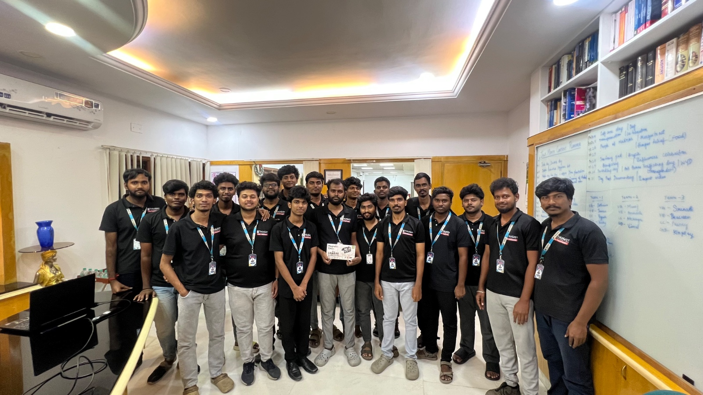
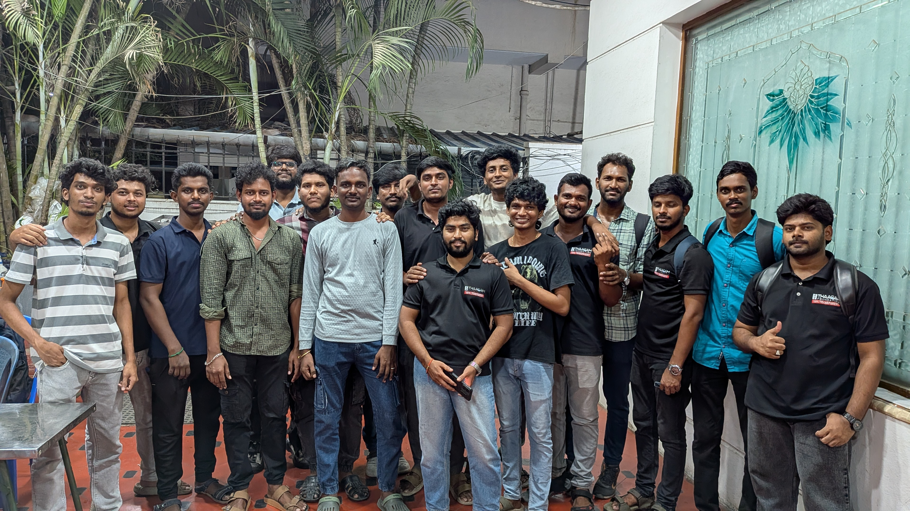
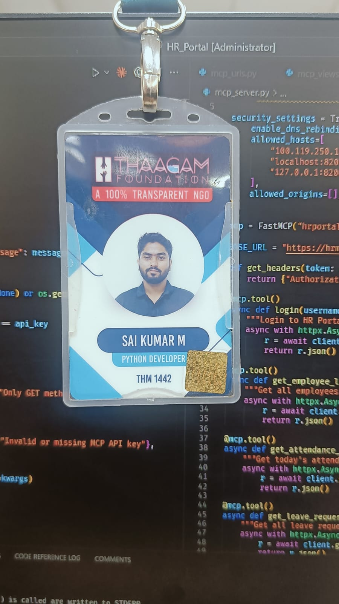
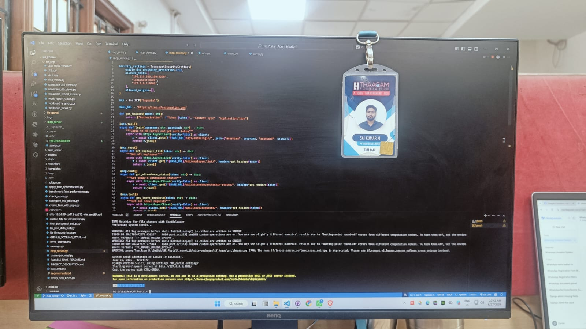

# Saikumar Mallarapu - Python Django Developer

Python Django Developer with 1 year and 2 months of production experience building secure web applications, REST APIs, PostgreSQL systems, automation workflows, and internal business tools.

> Currently looking for a full-time Python or Django backend role with a strong engineering team.

[View Portfolio](https://saikumarmallarapu.github.io) | [LinkedIn](https://linkedin.com/in/saikumarmallarapu) | [GitHub](https://github.com/saikumarmallarapu) | [Email](mailto:saikumar.pydev@gmail.com) | [Resume](assets/documents/saikumar_mallarapu_python_developer.pdf)

## Technical skills

- **Backend:** Python, Django, Django REST Framework, REST APIs, Celery
- **Database and security:** PostgreSQL, Redis, JWT, session authentication, RBAC
- **Deployment:** Docker, Linux, Nginx, Gunicorn, AWS
- **Automation:** Excel workflows, PDF generation, email campaigns, and third-party integrations

## Professional experience

### M7 Corporation - Python Django Developer

- Contributed to 13+ production projects across NGO, healthcare, workforce, communication, legal, and business platforms.
- Completed 500+ development tasks covering backend features, APIs, authentication, automation, reporting, deployment, and production support.
- Built and maintained Django applications using PostgreSQL, DRF, JWT, Linux, Nginx, and Gunicorn.

## Selected projects

- **Thaagam.org:** NGO management, donations, sponsorships, inventory, analytics, and automation.
- **GCC Workforce:** Attendance, leave approval, workforce operations, and role-based dashboards.
- **Comm AI:** Contact management and automated communication campaigns.
- **Balaram Child Neuro Care:** Multi-role healthcare management for therapists, parents, and patient workflows.
- **Email Campaign Bot:** Lead-generation campaigns, validation, daily sending workflows, bounce handling, and delivery monitoring.

Explore all projects and screenshots on the [portfolio website](https://saikumarmallarapu.github.io/#projects).

## Professional moments

### Team

<p align="center">
  
  
</p>

### Office identity and development system

<p align="center">
  
  
</p>

## Repository structure

```text
.
|-- index.html
|-- assets/
|   |-- css/styles.css
|   |-- js/projects.js
|   |-- js/script.js
|   |-- documents/
|   `-- images/
|       |-- branding/
|       |-- profile/
|       |-- projects/
|       `-- gallery/
|-- robots.txt
`-- sitemap.xml
```

## Adding a project

1. Add screenshots to `assets/images/projects/<project-name>/`.
2. Copy an existing project object in `assets/js/projects.js`.
3. Update the project content, technology list, URL, and image paths.
4. Use an empty `url` for private projects.

Project galleries automatically support autoplay, navigation arrows, touch swiping, and reduced-motion preferences.
